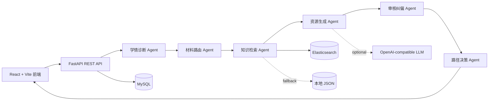

# 航空工程材料损伤分析多智能体个性化训练系统

面向航空工程学院学生、科研训练新手和航空维修学习者的垂直领域训练系统。系统围绕航空轮胎、航空刹车和飞机复合材料三类典型对象，完成“学情画像 -> 诊断 -> 多智能体协同 -> 证据检索 -> 个性化资源 -> 专家审核 -> 学习路径 -> 反馈迭代”的完整闭环。

本项目不是单一聊天机器人。学习者的输入会经过职责明确的 Agent 分工处理，最终输出可追溯、可审核、可继续迭代的训练资源。

- 源码仓库：<https://github.com/wxgith/aviation-material-multi-agent-training>
- 第一次运行请直接阅读：[START_HERE.md](START_HERE.md)
- 不安装 Docker 也能完成核心功能验收。

## 项目状态

当前版本为比赛正式冻结版，核心功能已经完成并通过验证：

| 项目 | 当前状态 |
| --- | --- |
| 前端 | React 19 + Vite 6 |
| 后端 | FastAPI + Python 3.11 |
| 智能体 | 6 个核心 Agent，完整顺序调度 |
| 数据存储 | MySQL 持久化，可关闭 |
| 知识检索 | Elasticsearch 优先，JSON 自动兜底 |
| 知识库 | 3 个材料方向、1,766 条可追溯切片 |
| 生成模式 | mock/template 稳定生成，预留 OpenAI-compatible LLM |
| 自动化验证 | 后端 116 passed，前端生产构建通过 |
| 测评材料 | 50 条核心用例及多组专项回归 |

## 核心能力

1. **学习者画像与学情诊断**：支持本科低年级学生、材料方向研究生、机务维修新员工等差异化画像。
2. **六 Agent 协同**：依次执行学情诊断、材料路由、知识检索、资源生成、审核纠偏和路径决策。
3. **领域 RAG 检索**：支持 BM25、Vector、Hybrid 设计；默认使用 Elasticsearch BM25/Hybrid，异常时自动回退本地 JSON。
4. **个性化资源生成**：生成讲义、实操指南、分阶测试题和案例分析任务。
5. **证据约束与幻觉防控**：展示 evidence ID、证据标题、适用条件和限制说明，审核 Agent 对生成结果再次校验。
6. **学习过程闭环**：输出学情报告，并根据反馈正确率决定降维解释、继续巩固、补充案例或进阶挑战。
7. **上下文智能助手**：能够结合当前页面、学习者画像、诊断结果和检索证据回答操作及专业问题。
8. **工程化与容错**：MySQL、Elasticsearch、LLM 均由环境变量控制，任一外部组件不可用时不会破坏核心演示流程。

## 系统架构



## 评委最快体验：不安装 Docker

这是最简单、最稳定的运行方式。只需要安装 Windows 10/11、Python 3.11 和 Node.js 20 LTS；首次安装依赖时需要联网。

安装好 Python 和 Node.js 后，可在项目根目录直接执行：

```powershell
powershell -ExecutionPolicy Bypass -File .\scripts\setup_mock_demo.ps1
```

脚本会自动创建 Python 虚拟环境、安装前后端依赖、生成安全的本地配置并启动系统。下面保留分步命令，供需要逐项检查的评委使用。

### 1. 解压并进入目录

建议解压到较短的路径，例如 `C:\agents-demo`：

```powershell
cd C:\agents-demo
```

### 2. 准备配置

```powershell
Copy-Item .\backend\.env.example .\backend\.env
```

`.env.example` 默认已经是便携模式：

```env
DATA_BACKEND=json
DATABASE_ENABLED=false
ES_ENABLED=false
LLM_ENABLED=false
```

### 3. 安装依赖

```powershell
py -3.11 -m venv backend\.venv
.\backend\.venv\Scripts\python.exe -m pip install --upgrade pip
.\backend\.venv\Scripts\python.exe -m pip install -r .\backend\requirements.txt

cd .\frontend
npm ci
cd ..
```

### 4. 一键启动

```powershell
.\scripts\start_project.ps1 -SkipDocker
```

访问：

- 前端：<http://127.0.0.1:5173>
- 健康检查：<http://127.0.0.1:8000/api/health>
- FastAPI 文档：<http://127.0.0.1:8000/docs>

此模式不需要 Docker、MySQL、Elasticsearch、DBeaver 或模型密钥。健康检查显示数据库和 ES 未连接属于正常状态，核心闭环仍可完整运行。

## 推荐体验流程

1. 打开首页，点击“加载演示案例”。
2. 确认本科低年级学生画像、航空轮胎方向和学习目标。
3. 提交诊断，查看得分、强项和知识盲区。
4. 启动 Agent 流程，查看 6 个 Agent 的输入、输出、置信度和证据 ID。
5. 查看个性化讲义、实操指南、分阶测试题和案例任务。
6. 查看审核纠偏意见和学情报告。
7. 导出 Markdown 学情报告。
8. 提交反馈测试，查看动态学习决策。
9. 使用智能助手提出页面操作或航空材料专业问题。

## 自动验收

无 Docker 的核心闭环验证：

```powershell
cd C:\agents-demo
.\scripts\reviewer_verify.ps1 -Mode mock
```

结果生成在 `outputs/reviewer_verification/`。后端测试和前端构建命令：

```powershell
cd C:\agents-demo\backend
.\.venv\Scripts\python.exe -m pytest -q

cd C:\agents-demo\frontend
npm run build
```

## SQL + Elasticsearch 工程模式

正式工程模式用于展示学习记录持久化和 Elasticsearch 证据检索。它不是运行核心闭环的必要条件。

推荐配置：

```env
DATA_BACKEND=sql
DATABASE_ENABLED=true
DATABASE_URL=mysql+pymysql://<user>:<password>@127.0.0.1:3306/agents

ES_ENABLED=true
ES_URL=http://127.0.0.1:9201
ES_INDEX_KNOWLEDGE=aviation_material_knowledge

LLM_ENABLED=false
```

准备好 MySQL 与 Elasticsearch 后执行：

```powershell
cd C:\agents-demo\backend
.\.venv\Scripts\python.exe -m app.db.seed
.\.venv\Scripts\python.exe -m app.search.indexer
cd ..
.\scripts\start_project.ps1
```

完整的容器、数据库、索引和故障排查步骤见 [DEPLOYMENT_GUIDE.md](DEPLOYMENT_GUIDE.md)。

## 可选真实 LLM

项目支持 OpenAI-compatible API，但比赛稳定演示不依赖模型密钥。部署者可在本地 `backend/.env` 中按需设置：

```env
LLM_ENABLED=true
LLM_BASE_URL=https://<provider>/compatible-mode/v1
LLM_API_KEY=<your-own-key>
LLM_MODEL=<model-name>
```

远程调用超时、失败或结构校验不通过时，系统自动回退 mock/template。任何真实密钥都不得提交到 GitHub。

## 目录结构

```text
backend/               FastAPI、Agent、RAG、SQL、ES 与测试
frontend/              React + Vite 用户界面
knowledge_corpus/      解析文本、知识切片、索引清单与实验资产
evaluation/            测评用例、指标、结果与提交样例
deploy/                Docker Compose 与部署配置
docs/                  系统设计、知识溯源、合规和答辩材料
scripts/               启动、停止、验收、备份和打包脚本
submission_materials/  本地正式提交材料，不上传 GitHub
```

## 数据与安全说明

- GitHub 仓库不包含 `.env`、API Key、数据库密码、虚拟环境、`node_modules`、日志、报名表或演示视频。
- 学习者示例均为模拟数据，不包含真实身份证号、手机号或学号。
- 处理后的知识片段保留来源、证据 ID、适用范围和引用边界。
- 原始公开文献与团队实验原始文件不随源码仓库发布；评审材料中的使用范围以授权和来源登记为准。
- DBeaver 只是数据库查看工具，不参与系统运行。

## 重要文档

- [评委快速验证](EVALUATOR_QUICKSTART.md)
- [完整部署说明](DEPLOYMENT_GUIDE.md)
- [系统设计方案](SYSTEM_DESIGN.md)
- [API 测试命令](API_TEST.md)
- [最终功能审查](FINAL_FUNCTIONAL_AUDIT.md)
- [知识库构建说明](knowledge_corpus/README.md)
- [测试与评价指标](docs/测试方案与评价指标.md)
- [幻觉防控与知识溯源](docs/幻觉防控与知识溯源方案.md)
- [数据合规与隐私保护](docs/数据合规与隐私保护说明.md)

## 当前边界

- 正式演示推荐使用 mock/template 生成，以避免网络和模型输出波动。
- 默认检索仍以 Elasticsearch BM25/Hybrid 为主，BGE 向量模型属于可选扩展。
- 当前实现满足比赛原型和本地部署；生产环境仍需完善数据库迁移、权限和监控。
- 外部专家盲审和真实学习效果验证仍可在后续扩大样本规模。

## 提交说明

GitHub 仓库用于提交源码和复现说明；PPT、报名表、设计方案 PDF、演示视频及完整材料包以比赛正式 ZIP 为准。当前仓库尚未声明开源许可证，未经授权不代表允许再次分发团队实验数据。
